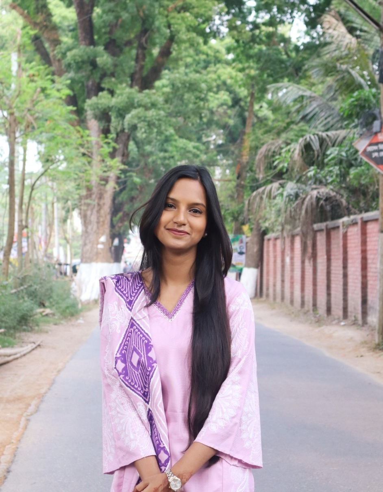

## *PROFILE PICTURE*

  

## *PROFILE*
A motivated and results-driven Computer Science and Engineering student with a focus on web design, artificial intelligence, and computational graphics. Proficient in programming languages such as C++ and C, and eager to leverage technical expertise and creativity in real-world projects while embracing opportunities for continuous growth and learning.

## *EDUCATION*

*Bachelor of Science in Computer Science and Engineering*  
- *Institution*:  Jahangirnagar University  
- Expected Graduation: 2025  

*Higher Secondary Certificate (HSC)*  
- *Institution*: Rajbari Govt. College  
- *Year*: 2017–2019  
- *Grade*: GPA 5.0/5.0  

*Secondary School Certificate (SSC)*  
- *Institution*: Rajbari Govt. Girls' High School  
- *Year*: 2012–2017  
- *Grade*: GPA 5.0/5.0  

## *EXPERIENCE*
*Private Tutoring*  
-Delivered personalized academic support through private tutoring, simplifying complex concepts to enhance students' understanding and foster a love for learning.

*Debating*
-Champion in inter district debate competition

*Clubing*
-worked for cultural and social welfare clubs

## *LANGUAGES*
- English: Fluent
- Bangla: Native 

## *SKILLS*
- *Programming Languages*: C++, C  
- *Web Development*: HTML, CSS, JavaScript, Hugo  
- *Graphics*: OpenGL, GLUT  
- *Tools & Technologies*: Git, VS Code, GitHub, Git Bash  
- *Operating Systems*: Linux, Windows  

## *CONTACT ME*
- *Phone*: 01759870454  
- *Email*: [jannatankhi29@gmail.com] 
- *Address*: Savar, Dhaka, Bangladesh